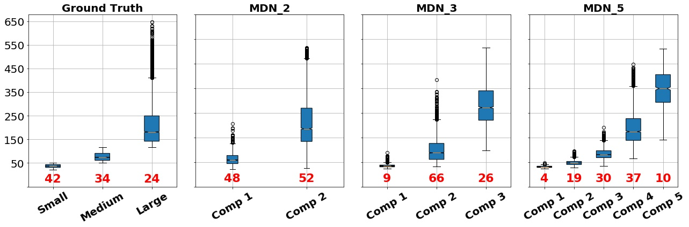

## [Mixture Dense Regression for Object Detection and Human Pose Estimation](https://arxiv.org/abs/1912.00821) (CVPR 2020)

Mixture models are well-established learning approaches that, in computer vision, have mostly been applied to inverse or ill-defined problems. However, they are general-purpose divide-and-conquer techniques, splitting the input space into relatively homogeneous subsets in a data-driven manner. Not only ill-defined but also well-defined complex problems should benefit from them. To this end, we devise a framework for spatial regression using mixture density networks. We realize the framework for object detection and human pose estimation. For both tasks, a mixture model yields higher accuracy and divides the input space into interpretable modes. For object detection, mixture components focus on object scale, with the distribution of components closely following that of ground truth the object scale. This practically alleviates the need for multi-scale testing, providing a superior speed-accuracy trade-off. For human pose estimation, a mixture model divides the data based on viewpoint and uncertainty -- namely, front and back views, with back view imposing higher uncertainty. We conduct experiments on the MS COCO dataset and do not face any mode collapse. 

For questions, please contact me at [ali.varamesh@kuleuven.be](ali.varamesh@kuleuven.be).

## Installation
1- Fiest use [mixturedense.yml](mixturedense.yml) to reproduce the exact [Anaconda](https://www.anaconda.com/download) environment that we have used for our experiments:
  ~~~
  conda env create -f mixturedense.yml
  ~~~
  To activate the environment:
  ~~~
  source activate mixturedense
  ~~~

2- Install [COCOAPI](https://github.com/cocodataset/cocoapi)

3- Compile deformable convolutional conda env create -f environment.yml(from [DCNv2](https://github.com/CharlesShang/DCNv2.git)).
  ~~~  
  cd src/lib/models/networks/DCNv2
  ./make.sh
  ~~~
 
## Train
To train models from scratch, first, organize the dataset in the following order and see sample commands at [experiments](experiments)

### Dataset preparation
For training and evaluation download the MS COCO dataset and organize it as indicated below:

#### COCO
- Download the images (2017 Train, 2017 Val, 2017 Test) from [coco website](http://cocodataset.org/#download).
- Download annotation files (2017 train/val and test image info) from [coco website](http://cocodataset.org/#download). 
- Place the data (or create symlinks) to make the data folder like:

~~~
optdata_dir
|-- coco
    |-- annotations
        |   |-- instances_train2017.json
        |   |-- instances_val2017.json
        |   |-- person_keypoints_train2017.json
        |   |-- person_keypoints_val2017.json
        |   |-- image_info_test-dev2017.json
    |-- train2017
    |-- val2017
    |-- test2017ll 
~~~

## Test
To test the models for detction and pose estimation on a images (stored in a directory) use the [inference_ctdet.py](inference_ctdet.py) and [inference_pose.py](nference_pose.py) scripts, respectively

## Pretrained models

[Detection_DLA34_1x_MDN_3](https://drive.google.com/file/d/1Eo3frOmNSMgMdE_G6XNAKRj3q5cyxWzi/view?usp=sharing)

[Detection_DLA34_1x_CenterNet](https://drive.google.com/file/d/1MrJJbII8Kc1tqvnPGmYoeGXTtPECfIQB/view?usp=sharing)

[Detection_HG_3x_CenterNet](https://drive.google.com/file/d/1ilHteHqkNi8UoOBJM5rXQ5PpvbBTqqvr/view?usp=sharing)

[Detection_HG_3x_MDN_3](https://drive.google.com/file/d/1-b7u6SvM77G9hKJi77WKc0CiFLk-Vru1/view?usp=sharing)

[Keypoints_HG_3x_CenterNet](https://drive.google.com/file/d/1CbuU9QGsdwG-F8r8Ij-pSS2gKYDOilv_/view?usp=sharing)

[Keypoints_HG_3x_MDN_3](https://drive.google.com/file/d/15e0HJbT-P0tGQnEjs-rOv1K9jKs0o-mg/view?usp=sharing)

[Detection_DLA34_CenterNet_COCO_10percent_Train_Resolution_768_100_epochs](https://drive.google.com/file/d/1HcmKQRDzWfSbtYZJk6Y5zpojhw9IsBJ6/view?usp=sharing)

[Detection_DLA34_MDN_3_COCO_10percent_Train_Resolution_768_100_epochs](https://drive.google.com/file/d/1sNDCtNeEdgRyilThJ6_Bh7m4roTPMw2n/view?usp=sharing)

## License

This repo is released under the MIT License. We have forked parts of the codebase from other repositories; please refer to the corresponding repositories for their licenses' details.

## Citation

    @article{varamesh2019mixture,
      title={Mixture Dense Regression for Object Detection and Human Pose Estimation},
      author={Varamesh, Ali and Tuytelaars, Tinne},
      journal={arXiv preprint arXiv:1912.00821},
      year={2019}
    }
## Acknoledgement
Our repo is forked from the amazing codebase of the [Object as Points paper](https://github.com/xingyizhou/CenterNet)
